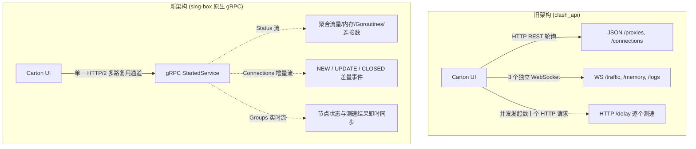
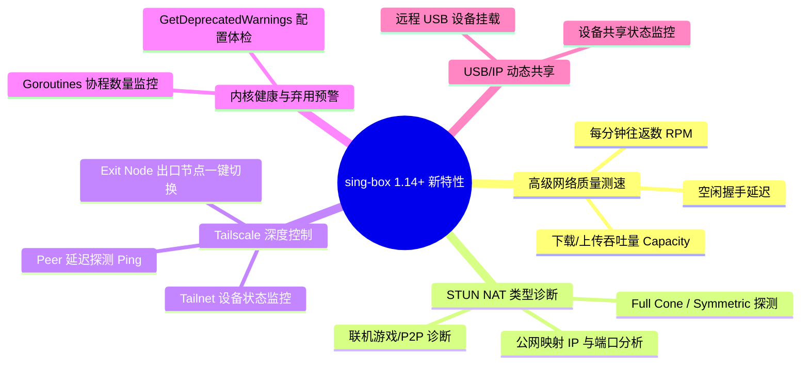

# carton 客户端全面迁移 sing-box 原生 gRPC API 技术方案与优化总结

> 本文档总结了 `carton` 项目从旧版 `clash_api`（REST / WebSocket）全面升级迁移至 sing-box 1.14+ 原生 gRPC API（`StartedService`）的架构设计、性能优化、实现落地与新版本功能规划。
>
> **后续文档**：重构路线与已知限制见 [SINGBOX_API_REFACTOR_PLAN.md](SINGBOX_API_REFACTOR_PLAN.md)；新 API 功能清单与接入决策见 [SINGBOX_API_FEATURES.md](SINGBOX_API_FEATURES.md)。

---

## 一、 背景与迁移目标

* **背景**：随着 sing-box 1.14 正式发布，官方推出了基于 **Protocol Buffers (Protobuf) + gRPC (HTTP/2)** 的原生管理 API（`StartedService`），并配套发布了全新的官方 Web 控制台 `sing-box-dashboard`。
* **迁移目标**：
  1. 彻底淘汰旧版 `experimental.clash_api` 的明文 JSON 和多路 WebSocket 轮询机制；
  2. 面向新版本构建高性能、低开销的现代化通信客户端；
  3. 解锁 sing-box 1.14+ 独有的高级功能（真实吞吐测速、STUN NAT 探测、Tailscale 生态控制等）。

---

## 二、 新旧架构全方位对比与功能优化

全面切换到 gRPC 之后，原有功能从“协议传输模式”到“业务执行效率”均获得了质的提升：



### 核心功能优化点详细分析

| 功能模块 | 旧版实现 (`clash_api`) | 新版实现 (gRPC `StartedService`) | 核心优化与优势 |
| :--- | :--- | :--- | :--- |
| **节点批量测速** | 客户端并发建立数十到上百个短连接 HTTP 请求（`GET /proxies/{tag}/delay`） | 客户端发送 `URLTest` 触发内核测速，测速结果由 `SubscribeGroups` 异步流式推回 | **避免本地端口耗尽**：彻底消除大量并发 HTTP 导致的卡死、丢包与超时。 |
| **活动连接管理** | 每次刷新调用 `GET /connections`，拉取包含数百条连接的巨大 JSON 并全量反序列化 | `SubscribeConnections` 采用增量模式：新连接推 `NEW`，更新推 `UPDATE`（仅带 Delta 差量），关闭推 `CLOSED` | **降低 90%+ 序列化与内存压力**：告别大 JSON 频繁分配，连接列表极其丝滑。 |
| **实时状态监控** | 同时维持 3 个独立的 WebSocket（`/traffic`、`/memory`、`/logs`）分别传输明文 JSON | 单一 `rpc SubscribeStatus` 流，同时包含瞬时速率、累计总量、内存、连接数、Goroutines | **数据更全、开销更低**：上下行总量由内核精确统计，无需客户端在应用层累加。 |
| **节点与模式同步** | 客户端定时轮询 `GET /proxies` 与 `GET /configs`，无法主动感知变更 | `SubscribeGroups` 与 `SubscribeClashMode` 实时事件推送 | **多端状态实时一致**：外部控制台或内核状态变更时，桌面客户端毫秒级自动刷新。 |
| **日志输出** | WebSocket 逐条推送文本，客户端解析字符串判断日志等级 | `SubscribeLog` 采用 Protobuf 强类型枚举与批量（Batch）二进制帧推送 | **高吞吐日志无阻塞**：支持 `ClearLogs` 远程清空日志缓存。 |

---

## 三、 新版本可直接解锁的全新功能

迁移到 gRPC 原生 API 后，`carton` 在后续版本中可直接扩展以下差异化功能：



1. **真实带宽吞吐测速（`StartNetworkQualityTest`）**
   * 不再只是单一的 HTTP 204 延迟测试，而是可对代理节点进行完整的网络质量分析（下载吞吐容量、上传吞吐容量、RPM 以及真实响应延迟）。
2. **STUN NAT 类型探测（`StartSTUNTest`）**
   * 一键诊断当前节点或本地网络的 NAT 类型（Full Cone, Restricted, Port-Restricted, Symmetric），专为联机加速与 P2P 场景设计。
3. **Tailscale 深度控制（`SubscribeTailscaleStatus` / `SetTailscaleExitNode`）**
   * 自动发现 Tailscale endpoint 状态，直接在界面展示 Tailnet 设备并在 UI 上一键切换 Tailscale 出口节点。
4. **配置弃用体检（`GetDeprecatedWarnings`）**
   * 获取内核实时反馈的配置弃用警告，为用户提供智能迁移建议。

---

## 四、 代码实现与改造详情

### 1. 工具链与依赖配置 (`carton.Core.csproj`)
* 引入微软与 Google 官方标准 gRPC 工具链：
  * `Grpc.Net.Client` (v2.71.0)
  * `Google.Protobuf` (v3.30.0)
  * `Grpc.Tools` (v2.71.0，编译期使用，不增加发布包体积)
* 引入契约文件：`Protos/started_service.proto`。

### 2. 客户端实现 (`SingBoxGrpcApiClient.cs`)
* 实现了完整的 `ISingBoxApiClient` 接口，底层使用基于 `SocketsHttpHandler` 的 HTTP/2 多路复用长连接。
* 包含了 `Authorization: Bearer <secret>` 认证拦截支持与异常恢复逻辑。
* 彻底移除了原有的 `ClashHttpApiClient.cs`。

### 3. 配置生成与运行时注入
* **默认配置模板** (`ConfigManager.cs`)：
  ```json
  "services": [
    {
      "type": "api",
      "tag": "carton-api",
      "listen": "127.0.0.1",
      "listen_port": 9090
    }
  ]
  ```
* **运行时准备** (`DashboardViewModel.cs`)：
  * 自动分配 native API 端口，直接注入 `services` 节点；
  * 保留最小 `experimental.clash_api`（空 `external_controller`，不监听 REST）作为 gRPC 模式功能的后端；
  * 自动补齐 `cache_file.store_dns = true` 等 1.14 规范字段（不覆盖用户显式配置）。

---

### 5. 测试与验证情况

* **构建验证**：`dotnet build` 整体解决方案（Core / GUI / Tests / Benchmarks）生成成功，**0 错误，0 警告**。
* **测试套件**：`dotnet test` 全部单元测试通过（含新增的 gRPC 契约测试：订阅间隔纳秒换算、URL 测新鲜度判定）。
* **NativeAOT 发布**：win-x64 `PublishAot=true` 实测成功（gRPC/Protobuf AOT 兼容）。

### 6. 已知限制（诚实声明，详见重构计划）

> **关于 `clash_api` 配置块的说明（全面废弃 Clash API 的语义边界）**：旧 Clash HTTP
> REST API（ClashHttpApiClient、external_controller 监听、`/ui/` 面板、双 API 下拉选择）
> 已在迁移中**全部移除**，Dashboard 的 WebUI 按钮改为直开 sing-box 官方面板。代码中
> 保留的 `experimental.clash_api` 配置块**不是旧 API 的残留**——它是 sing-box 内核创建
> 出站模式后端（gRPC `GetClashModeStatus`/`SetClashMode`/`SubscribeClashMode` 的服务端
> 依赖，见 sing-box v1.14.0 `box.go` needClashAPI 判定）的必填写法，`external_controller`
> 显式置空串确保不监听任何 REST 端口。功能与代码命名已全面去 Clash 化
> （ProxyModeCacheService / ModeOptions / 出站模式），仅 wire 协议名与配置键按 sing-box
> 契约原样保留。

> **API secret 的威胁模型说明**：carton **从不向内核配置写入任何 secret**（用户的
> api 服务块与 carton 自建块均不写）。唯一可能出现 secret 的来源是**用户自己在
> services.api.secret / clash_api.secret 里配置的值**——carton 读取它用于连接鉴权，
> 但不修改不传播。用户未配置时内核以无鉴权模式运行（sing-box 的 `secret == ""`
> 即关闭鉴权检查，这是内核的正式设计），carton 匿名连接。> 由用户自行在配置中提供 secret。
>
> **知情记录（外部 review #6）**：无 secret 叠加 gRPC reflection（v1.14.0
> daemon/server.go:25 默认注册）与 CORS 白名单中的明文 http origin，理论上存在
> MITM/DNS 劫持页面经明文 origin 调用本机 API 的风险面。这是“不强加 secret”
> 决策的已知代价，维持产品决策；若未来要收口，方向是仅对 carton 自建 api 块
> 注入随机 secret（用户块仍一字不动），与块级主权原则兼容。

* **内核版本硬性要求 ≥ 1.14.0**：启动前有版本闸门与明确报错。
* **保留最小 `experimental.clash_api`（空 `external_controller`）**：gRPC 的 clash 模式三件套依赖 ClashServer 存在；彻底删除会让模式切换 UI 失效、`clash_mode` 路由规则永不匹配。
* **流量/连接已是流式**：Groups/Connections/Clash 模式均由内核长驻流推送驱动（Phase 1 已落地），残留的一次性拉取仅作常驻流冷启动/重连期间的降级路径。
* **ClearLogs / SubscribeClashMode 等能力尚未接入 UI**（见功能清单 P1/P2）。
